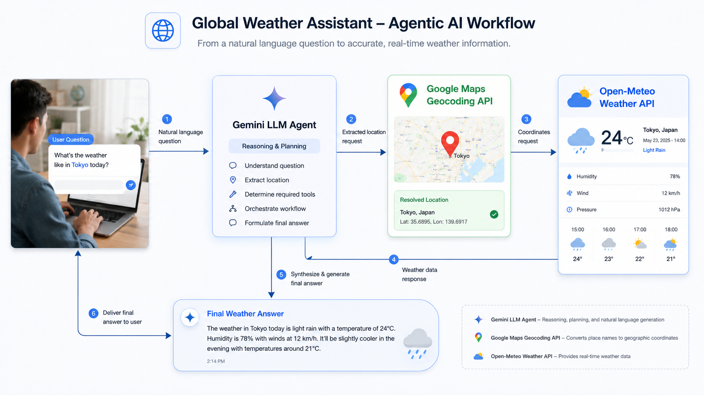

# GenAI Weather Agent

An agentic weather assistant built with LangGraph and Gemini tool calling. It converts user-provided place names into coordinates with the Google Maps Geocoding API, fetches global weather data from Open-Meteo, and returns a concise natural-language answer.



## How It Works

The assistant follows a simple tool-using workflow:

1. The user asks a weather question.
2. Gemini decides which tools are needed.
3. `latlon_geocoder` converts a location into latitude and longitude using Google Maps.
4. `get_weather_forecast` fetches current and forecast weather from Open-Meteo.
5. Gemini summarizes the tool results into a user-friendly answer.

## Project Structure

```text
agentic_workflow/
  lg_agent.py          # LangGraph weather agent
  requirements.txt     # Python dependencies
docs/
  agentic-weather-workflow.png
```

## Requirements

- Python 3.11 or 3.12
- Google Maps API key
- Google Gemini API key

Install dependencies:

```powershell
cd C:\Users\Manzi\Desktop\genai_weather_predictor
.\.venv\Scripts\Activate.ps1
cd agentic_workflow
python -m pip install -r requirements.txt
```

## Environment Variables

Set your keys in PowerShell before running:

```powershell
$env:GOOGLE_MAPS_API_KEY="your_google_maps_api_key"
$env:GOOGLE_API_KEY="your_gemini_api_key"
```

Optional model override:

```powershell
$env:GEMINI_MODEL="gemini-2.5-flash"
```

## Run

From the `agentic_workflow` folder:

```powershell
python lg_agent.py
```

Example:

```text
Ask a weather question: Is it raining in Kigali?
```

Expected style of output:

```text
No, it is not currently raining in Kigali. The current conditions show no rain, with the forecast indicating a low chance of precipitation.
```

## Notes

- Open-Meteo provides worldwide weather forecast data by latitude and longitude.
- Google Maps Geocoding is used to support flexible place-name input.
- Gemini API quota limits may affect execution. If quota is exhausted, wait for the quota window to reset, switch models, or enable billing/quota for the Google AI project.
